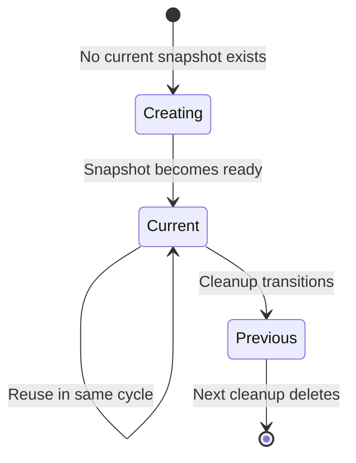

# Snapshot Lifecycle Implementation Plan

## Goal
Implement restart-resilient snapshot management using status labels (`current` and `previous`) to enable snapshot reuse within a cycle and controlled cleanup across cycles.

## Core Principle

**Synchronize()** → **Cleanup()** execution order ensures:
- Each sync uses `status=current` snapshot (reuses if exists)
- Each cleanup transitions `current` → `previous` and deletes old `previous`
- Fresh snapshot created each cycle after cleanup

## State Transitions



## Implementation Tasks

### 1. Add Constants
Location: [`internal/mover/cephfs/mover.go`](internal/mover/cephfs/mover.go:51-65)

```go
const (
    snapshotStatusLabelKey = utils.VolsyncLabelPrefix + "/snapshot-status"
    snapshotStatusCurrent  = "current"
    snapshotStatusPrevious = "previous"
)
```

### 2. Add Helper Functions

```go
// Check if snapshot is ready to use
func isSnapshotReady(snap *snapv1.VolumeSnapshot) bool

// Find snapshot with specific status label owned by this mover
func (m *Mover) findSnapshotWithStatus(ctx context.Context, status string) (*snapv1.VolumeSnapshot, error)

// List all snapshots with specific status label
func (m *Mover) listSnapshotsWithStatus(ctx context.Context, status string) ([]snapv1.VolumeSnapshot, error)

// Update snapshot status label
func (m *Mover) setSnapshotStatus(ctx context.Context, snap *snapv1.VolumeSnapshot, status string) error
```

### 3. Custom Snapshot Logic

**Add:** [`ensurePVCFromSrcWithStatusLabels()`](internal/mover/cephfs/mover.go)

```go
func (m *Mover) ensurePVCFromSrcWithStatusLabels(ctx, log, src, dataName) (*PVC, error) {
    // Only for Snapshot copy method
    if m.vh.copyMethod != volsyncv1alpha1.CopyMethodSnapshot {
        return m.vh.EnsurePVCFromSrc(ctx, log, src, dataName, true)
    }
    
    // Look for snapshot with status=current
    currentSnap, err := m.findSnapshotWithStatus(ctx, snapshotStatusCurrent)
    if err != nil {
        return nil, err
    }
    
    var snap *snapv1.VolumeSnapshot
    
    if currentSnap != nil && isSnapshotReady(currentSnap) {
        // Reuse existing snapshot
        snap = currentSnap
    } else if currentSnap != nil {
        // Snapshot exists but not ready - wait
        return nil, nil
    } else {
        // Create new snapshot with status=current
        snap, err = m.ensureSnapshotWithStatusLabel(ctx, log, src, dataName)
        if snap == nil || err != nil {
            return nil, err
        }
    }
    
    // Create PVC from snapshot
    return m.createPVCFromSnapshot(ctx, log, snap, src, dataName)
}
```

**Add:** [`ensureSnapshotWithStatusLabel()`](internal/mover/cephfs/mover.go)

```go
func (m *Mover) ensureSnapshotWithStatusLabel(ctx, log, src, name) (*snapv1.VolumeSnapshot, error) {
    // CreateOrUpdate snapshot with status=current label
    // Wait for ready
    // Return snapshot or nil if not ready
}
```

**Add:** [`createPVCFromSnapshot()`](internal/mover/cephfs/mover.go)

```go
func (m *Mover) createPVCFromSnapshot(ctx, log, snap, src, name) (*PVC, error) {
    // CreateOrUpdate PVC with DataSource pointing to snapshot
    // Wait for bound
    // Return PVC
}
```

### 4. Update ensureSourcePVC()

**Modify:** [`ensureSourcePVC()`](internal/mover/cephfs/mover.go:472)

```diff
- pvc, err := m.vh.EnsurePVCFromSrc(ctx, m.logger, srcPVC, dataName, true)
+ pvc, err := m.ensurePVCFromSrcWithStatusLabels(ctx, m.logger, srcPVC, dataName)
```

### 5. Enhance Cleanup()

**Modify:** [`Cleanup()`](internal/mover/cephfs/mover.go:304)

```go
func (m *Mover) Cleanup(ctx context.Context) (mover.Result, error) {
    // Step 1: Mark all status=previous for deletion
    previousSnaps, _ := m.listSnapshotsWithStatus(ctx, snapshotStatusPrevious)
    for _, snap := range previousSnaps {
        utils.MarkForCleanup(m.owner, &snap)
        m.client.Update(ctx, &snap)
    }
    
    // Step 2: Transition status=current to status=previous
    currentSnap, _ := m.findSnapshotWithStatus(ctx, snapshotStatusCurrent)
    if currentSnap != nil {
        m.setSnapshotStatus(ctx, currentSnap, snapshotStatusPrevious)
    }
    
    // Step 3: Remove snapshot annotations (destination only)
    if !m.isSource {
        _, destPVCName := m.getDestinationPVCName()
        m.vh.RemoveSnapshotAnnotationFromPVC(ctx, m.logger, destPVCName)
    }
    
    // Step 4: Delete marked objects
    return utils.CleanupObjects(ctx, m.client, m.logger, m.owner, cleanupTypes)
}
```

## Multi-Cycle Behavior

| Cycle | Before Sync | After Sync | After Cleanup |
|-------|-------------|------------|---------------|
| 1 | None | snap-1 [current] | snap-1 [previous] |
| 2 | snap-1 [previous] | snap-1 [previous], snap-2 [current] | snap-2 [previous] |
| 3 | snap-2 [previous] | snap-2 [previous], snap-3 [current] | snap-3 [previous] |

## Restart Resilience

- **During snapshot creation:** Reuses partially created snapshot with `status=current`
- **During job execution:** Reuses ready snapshot with `status=current`
- **After cleanup transition:** Creates new snapshot since no `status=current` exists

## Key Benefits

1. ✅ Snapshot reused within reconciliation cycle (restart resilient)
2. ✅ Fresh snapshot created each new cycle (latest data)
3. ✅ One previous snapshot preserved (rollback capability)
4. ✅ Controlled cleanup (no snapshot accumulation)

## Files Modified

- [`internal/mover/cephfs/mover.go`](internal/mover/cephfs/mover.go) - All changes in this file

## Next Steps

1. Implement helper functions
2. Implement custom snapshot logic
3. Update ensureSourcePVC() and Cleanup()
4. Test with multiple sync cycles
5. Validate restart scenarios
